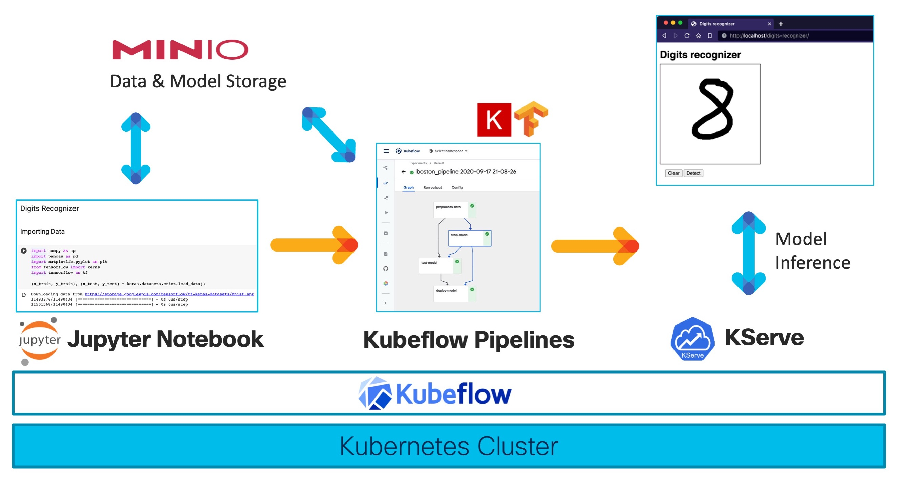

# MLOps-model-deployment
## Project Title: Implementing Kubeflow with Kserve for Model Deployment
https://docs.google.com/document/d/1nd5hAj-uBgsyIVKBxziZz-MZJc0cC4t6bvlCmGf3_tc/edit 

#### Project Description: 
Kubeflow is an open-source platform that makes it easy to deploy and manage machine learning workflows on Kubernetes. Kserve is another open-source platform that provides a serverless model deployment system for Kubernetes.

In this project, you will be setting up a Kubeflow cluster and integrating it with Kserve to deploy a model trained on a dataset. You will then use this setup to track the performance of the deployed model.


#### Project Tasks:
1. Install and configure Kubeflow on a Kubernetes cluster
2. Install and configure Kserve on the same cluster
3. Write a Python script to train a model on a dataset
4. Use Kserve to deploy the trained model as a serverless deployment on Kubernetes
5. Write a Python script to test the deployed model's performance using the Kserve REST API.
6. Use Kubeflow to create an experiment and track the performance of the deployed model

## =====GUIDE LINE ==========
### My self and youtube


#### 1. Install and configure Kubeflow on a Kubernetes cluster

- Start cluster with minikube (or microk8s)
- In mycase I use minikube

- link for implement kubeflow: https://dagshub.com/blog/how-to-install-kubeflow-locally/ 
- link to manifest repo: https://github.com/kubeflow/manifests 
- Pods take 30m to run in my case (cpus=12, mem=7GB)

```bash
kubectl get pods -A

while ! kustomize build example | awk '!/well-defined/' | kubectl apply -f -; do echo "Retrying to apply resources"; sleep 10; done

```
- Incluster
  - remove: kubectl -n kube-system delete deployment,pod,svc --all --force
  - restart: kubectl rollout restart deploy -n <namespace-name>

- if your Pods can not run all (delete old cluster and create a new one)
```bash
minikube stop
minikube delete
minikube delete
```  

  
```
NAMESPACE                   NAME                                                              READY   STATUS      RESTARTS        AGE
auth                        dex-7ff46847-47jqg                                                1/1     Running     0               3h12m
cert-manager                cert-manager-7fb78674d7-tslkx                                     1/1     Running     0               3h12m
cert-manager                cert-manager-cainjector-5dfc946d84-8jzld                          1/1     Running     0               3h12m
cert-manager                cert-manager-webhook-8744b7588-pcm97                              1/1     Running     0               3h12m
istio-system                authservice-0                                                     1/1     Running     0               3h12m
istio-system                cluster-local-gateway-675bb7b74-d9kw2                             1/1     Running     0               3h12m
istio-system                istio-ingressgateway-c7fdd4bf6-72dc5                              1/1     Running     0               3h12m
istio-system                istiod-6995577d4-j7xjq                                            1/1     Running     0               3h12m
knative-eventing            eventing-controller-86647cbc5b-stdqp                              1/1     Running     0               3h12m
knative-eventing            eventing-webhook-6f48bb5f4c-n4jt2                                 1/1     Running     0               3h12m
knative-serving             activator-855b695596-5p8xv                                        2/2     Running     0               3h10m
knative-serving             autoscaler-7cbddfc9f7-dkvls                                       2/2     Running     0               3h10m
knative-serving             controller-6657c556fd-fxzzc                                       2/2     Running     0               3h10m
knative-serving             domain-mapping-544987775c-t5ldt                                   2/2     Running     0               3h10m
knative-serving             domainmapping-webhook-6b48bdc856-mt7p5                            2/2     Running     0               3h10m
knative-serving             net-istio-controller-6fbdbd9959-qn6nl                             2/2     Running     0               3h10m
knative-serving             net-istio-webhook-7d4879cd7f-7hbng                                2/2     Running     0               3h10m
knative-serving             webhook-665c977469-kz7nf                                          2/2     Running     0               3h10m
kube-system                 coredns-787d4945fb-qtw29                                          1/1     Running     0               3h13m
kube-system                 etcd-minikube                                                     1/1     Running     0               3h13m
kube-system                 kube-apiserver-minikube                                           1/1     Running     0               3h13m
kube-system                 kube-controller-manager-minikube                                  1/1     Running     0               3h13m
kube-system                 kube-proxy-t59n4                                                  1/1     Running     0               3h13m
kube-system                 kube-scheduler-minikube                                           1/1     Running     0               3h13m
kube-system                 storage-provisioner                                               1/1     Running     1 (3h12m ago)   3h13m
kubeflow-user-example-com   digits-recognizer-pipeline-7nvqk-1599600504                       0/2     Completed   0               76m
kubeflow-user-example-com   digits-recognizer-pipeline-7nvqk-1808267719                       0/2     Completed   0               77m
kubeflow-user-example-com   digits-recognizer-pipeline-7nvqk-1849466815                       0/2     Completed   0               75m
kubeflow-user-example-com   digits-recognizer-pipeline-7nvqk-1861154525                       0/2     Completed   0               76m
kubeflow-user-example-com   digits-recognizer-pipeline-7nvqk-566761592                        0/1     Completed   0               77m
kubeflow-user-example-com   digits-recognizer-pipeline-g8vmd-900720095                        0/1     Completed   0               95m
kubeflow-user-example-com   digits-recognizer-pipeline-l96pw-1405454503                       0/1     Completed   0               90m
kubeflow-user-example-com   digits-recognizer-pipeline-q2gb2-3897804321                       0/1     Completed   0               106m
kubeflow-user-example-com   digits-recognizer-pipeline-sgrbm-2795008036                       0/2     Completed   0               130m
kubeflow-user-example-com   digits-recognizer-predictor-default-00001-deployment-6cd9572xhx   2/2     Running     0               58m
kubeflow-user-example-com   kha-test-0                                                        2/2     Running     0               92m
kubeflow-user-example-com   ml-pipeline-ui-artifact-fb8c99584-zcgjb                           2/2     Running     0               168m
kubeflow-user-example-com   ml-pipeline-visualizationserver-6659778c46-87fpn                  2/2     Running     0               168m
kubeflow                    admission-webhook-deployment-6d48f6f745-qsh2p                     1/1     Running     0               3h10m
kubeflow                    cache-server-6b44c46d47-vls5j                                     2/2     Running     0               3h10m
kubeflow                    centraldashboard-f966d7897-z95xg                                  2/2     Running     0               3h10m
kubeflow                    jupyter-web-app-deployment-7685ddb979-75h6j                       2/2     Running     0               3h10m
kubeflow                    katib-controller-746969dc99-mnbtt                                 1/1     Running     0               3h10m
kubeflow                    katib-db-manager-5ddbffd67-ld9lj                                  1/1     Running     0               3h10m
kubeflow                    katib-mysql-66c8cdff4f-w77p2                                      1/1     Running     0               3h10m
kubeflow                    katib-ui-58b54d465f-jsrtp                                         2/2     Running     1 (3h3m ago)    3h11m
kubeflow                    kserve-controller-manager-96b896c66-vzxw7                         2/2     Running     0               3h11m
kubeflow                    kserve-models-web-app-9fbcd79f5-rjn2j                             2/2     Running     0               3h11m
kubeflow                    kubeflow-pipelines-profile-controller-6f6bc888df-4544s            1/1     Running     0               3h11m
kubeflow                    metacontroller-0                                                  1/1     Running     0               3h10m
kubeflow                    metadata-envoy-deployment-7b49bdb748-nzl7t                        1/1     Running     0               3h11m
kubeflow                    metadata-grpc-deployment-6d744c66bb-7hkls                         2/2     Running     8 (172m ago)    3h11m
kubeflow                    metadata-writer-5bfdbf79b7-dw8bj                                  2/2     Running     6 (168m ago)    3h11m
kubeflow                    minio-549846c488-426kv                                            2/2     Running     0               3h11m
kubeflow                    ml-pipeline-86d69497fc-q8v96                                      2/2     Running     7 (169m ago)    3h11m
kubeflow                    ml-pipeline-persistenceagent-5789446f9c-schzk                     2/2     Running     0               3h11m
kubeflow                    ml-pipeline-scheduledworkflow-fb9fbd76b-9xf79                     2/2     Running     0               3h11m
kubeflow                    ml-pipeline-ui-74fcbdddd9-mgjzt                                   2/2     Running     0               3h11m
kubeflow                    ml-pipeline-viewer-crd-bdf696cb9-jshqz                            2/2     Running     1 (172m ago)    3h11m
kubeflow                    ml-pipeline-visualizationserver-845d745b46-7dgc5                  2/2     Running     0               3h11m
kubeflow                    mysql-5f968d4688-lxq5p                                            2/2     Running     0               3h11m
kubeflow                    notebook-controller-deployment-576df594fd-q9hnx                   2/2     Running     1 (172m ago)    3h11m
kubeflow                    profiles-deployment-7bc6469cdd-g2pwm                              3/3     Running     1 (168m ago)    3h11m
kubeflow                    tensorboard-controller-deployment-84954cb455-5cxl6                3/3     Running     1 (172m ago)    3h11m
kubeflow                    tensorboards-web-app-deployment-7d4f745c6d-rkpf6                  2/2     Running     0               3h11m
kubeflow                    training-operator-7c5456c65-vfr5c                                 1/1     Running     0               3h11m
kubeflow                    volumes-web-app-deployment-5f794d44cf-xgdbl                       2/2     Running     0               3h11m
kubeflow                    workflow-controller-56cc57796-zgk48                               2/2     Running     1 (170m ago)    3h11m
minio-dev                   minio                                                             0/1     Pending     0               156m
```

- set up minikube for docker: 
```bash
eval $(minikube docker-env)
```

- For set up resource for minikube( default not enough for kubeflow): minikube config view
- command set up resource: 
```bash
minikube stop
minikube config set memory 7192
minikube config set cpus 12
minikube config view
minikube delete -f
minikube start
```

### 2. Set up notebook and training

- Command for forward port
  - for kubeflow ui:    ```kubectl port-forward svc/istio-ingressgateway -n istio-system 8080:80```
  - for MinIO ui:       ```kubectl port-forward -n kubeflow svc/minio-service 9000:9000```

- command for permission
```bash
kubectl apply -f kubernetes/kubeflow/access_kfp_from_jupyter_notebook.yaml

- Set up minio for storage
kubectl apply -f kubernetes/minio/minio-dev.yaml
# accesskey: minio
# secretkey: minio123
# bucket: mlpipeline

```

### 3. Install and configure Kserve on the same cluster
- set up kserve with minio to store model
```bash
kubectl apply -f kubernetes/kserve/set-minio-kserve-secret.yaml
```
- Test training and store model to s3 minio

### 4. Notebook for train and serve and test

- Set up notebook with many cpus or mem will lead to error, Serving same case
- check ```./kubernetes/kserve/model_kserce_inference.yaml for serving```

# ========REFERENCE==========
1. https://github.com/flopach/digits-recognizer-kubeflow (https://www.youtube.com/watch?v=6wWdNg0GMV4&ab_channel=TechnologywithFlo )
2. 
3. 